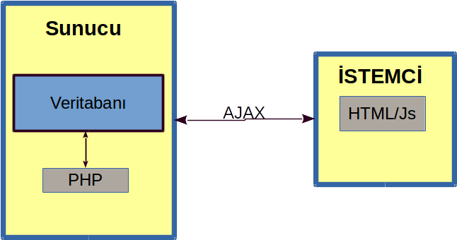

# Uludağ Üniversitesi Dahili Hatlar Telefon Sorgulama Uygulaması

Uludağ Üniversitesi'nin dahili hatlarının sorgulanabilineceği, ekleme ve çıkarma yapılabilineceği web-veritabanı uygulamasıdır.

## Ne, Nasıl?

### Kullanılan teknolojiler

* **Html:**
    Kullanıcı tarafında gösterilecek parçacıkların tasarımı ve kodlanması burada yapılır. \*.html uzantılardır.
* **Javascript:**
    HTML dosyalarının içine gömülmüş kullanıcının ortamında çalışacak programlama dilidir.
* **Php:**
    Sunucu tarafında çalışacak programlama dilidir.
* **Ajax:**
    Javascript ve Php programlama dilleri arasında iletişimi sağlayacak teknolojidir. XMLHTMLRequest yordamını kullanır.
* **MySQL:**
    Verilerin depolandığı veritabanıdır. MySQL erişimi PHP ile sağlanacaktır.

### Arkaplanda Gerçekleşenler

Geliştiriciler tarafından yazılan, kullanıcının görmeyeceği, kodların tümüdür.
Genel akış şu biçimdedir:

Sunucu makinede (Bu normal bir bilgisayar da olabilir.) tüm dosyalar bulunur. Bu dosyalar:
* Html dosyası
* MySQL dosyası
* PHP dosyası

Kullanıcı kendi bilgisayarında (istemci) web sitesini açınca sunucudan istemciye HTML dosyası ve buna bağlı dosyalr gönderilir (CSS, resimler vs.) gönderilir. HTML dosyasının içeriği tamamen istemci tarafında çalıştırılır.

İstemci tarafından web sayfası içinden sorgulanan isim, numara vs. alınacak ve Javascript ile işlenmiş AJAX teknolojisiyle sunucudaki PHP dosyasına gidecektir. PHP dosyası alacağı bu bilgileri gereken yerlerde kullanacak ve bir sonuç oluşturacaktır. Bu sonucu PHP ile işlenmiş AJAX teknolojisiyle yeniden istemciye iletecektir. Bu şekilde veritabanı ve kullanıcı arasındaki iletişim kurulacaktır.

## Uygulamada ne olacak:

 Uygulamanın iki adet hedef kitlesi olacaktır.

 1. Normal kullanıcı
 2. Yönetici yetkisine sahip kullanıcı

 ### Normal Kullanıcı:

 Yalnızca sorgulama yetkisine sahip kullancıdır. İstediği ismi girer ve numaranın ona iletilmesini bekler. Kullanıcı:

 * Direkt istediği sorguyu içeren numaraları göreceği
 * İstediği sorgunun, içinde bulunan tüm numaraları göreceği
 * Numarayı verip isim sorgulayabileceği

 seçenekler olacaktır.

 ### Yönetici Kullanıcı:

 Sorgulama, ekleme, değiştirme ve silme yetkilerine sahip kullanıcıdır. Veritabanındaki numara tablosu içinde tüm yetkilere sahiptir. Şifre tablosuna erişemez.

 Normal kullanıcılar şifre ile yönetici kullanıcı olabilir. 
